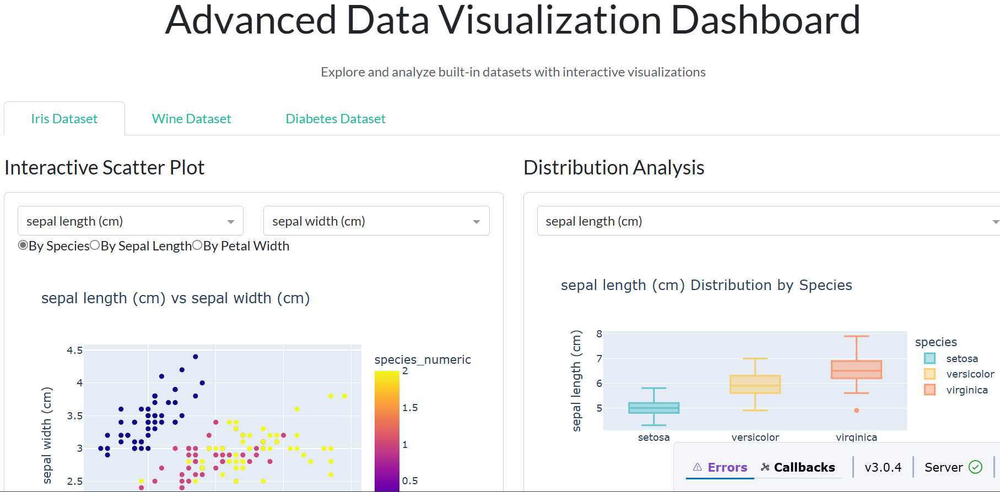
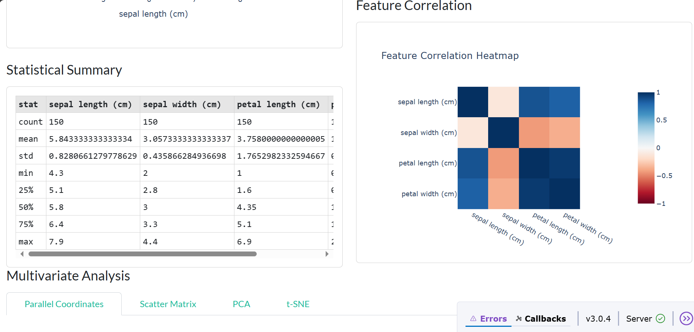
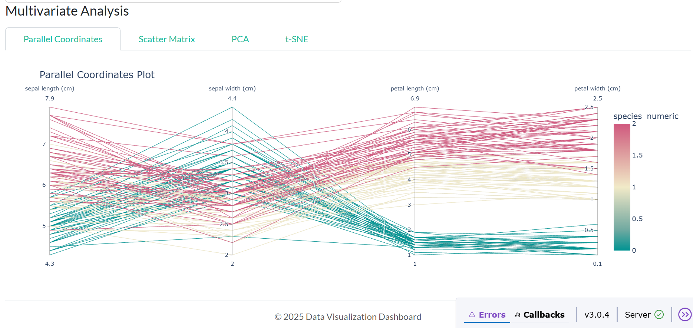
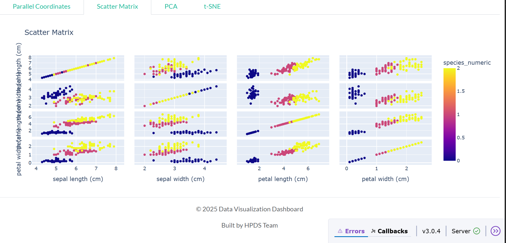
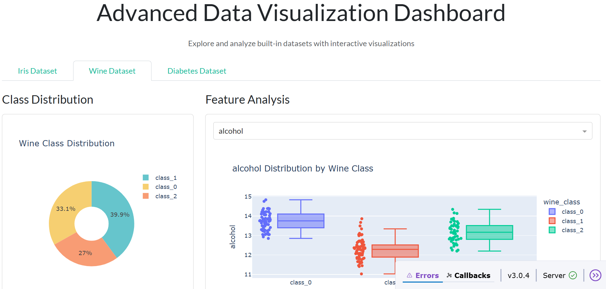
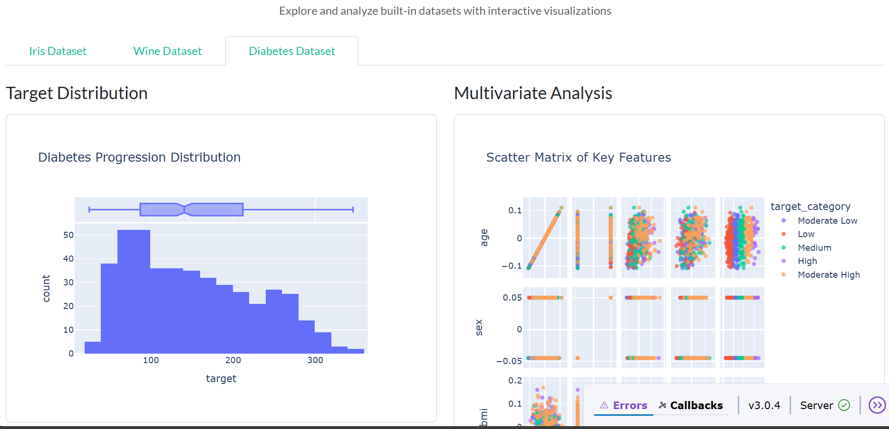

# Advanced Data Visualization Dashboard

This project is an **interactive data visualization dashboard** built using **Dash**, **Plotly**, and **scikit-learn**. It allows users to explore, analyze, and visualize three popular built-in datasets: **Iris**, **Wine**, and **Diabetes**.

## ✨ Features

- **Iris Dataset**
  - Interactive scatter plots with PCA and t-SNE features
  - Statistical summary table
  - Box plots for feature distributions
  - Correlation heatmap
  - Multivariate visualizations: Parallel Coordinates, Scatter Matrix, PCA, and t-SNE

- **Wine Dataset**
  - Pie chart for wine class distribution
  - PCA feature importance
  - Interactive feature-wise analysis
  - PCA scatter plot
  - Correlation heatmap of features

- **Diabetes Dataset**
  - Target value distribution with histogram and box plot
  - [*More diabetes visualizations can be added as needed*]

## 📊 Datasets Used

- **Iris**: Classification of iris flowers into 3 species based on petal and sepal features.
- **Wine**: Classification of wines based on chemical analysis.
- **Diabetes**: Regression dataset to study disease progression based on diagnostic 

Screenshots:
     
features.

These datasets are loaded using `sklearn.datasets`.

## 🛠️ Technologies Used

- **Dash** (with Bootstrap Components)
- **Plotly Express**
- **Pandas**, **NumPy**
- **scikit-learn** (for PCA, t-SNE, scaling)
- **Dash DataTable**

## 🚀 Installation

1. Clone the repository:
   ```bash
   git clone https://github.com/harrisonokoth/visualization-dashboard.git
   cd visualization-dashboard
